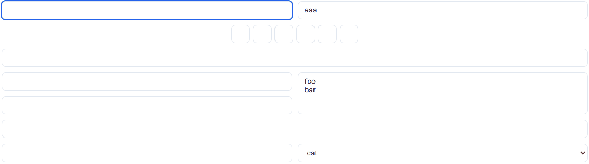
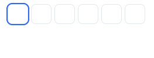

- Adds keyboard navigation to any page **without changing the HTML**
- **Framework friendly**: Doesn't add or remove any html: elements, classes or attributes - meaning it won't make any conflicts with your existing framework's client state
- **Opt-in behaviour**: Simply importing the library will not override any page behaviour, and it can be enabled at the per-element level
- **Auto flow** (opt-in): enables your focus to automatically be shifted to the next element once you hit the character limit on the current input


## Getting Started

Import the library in your client side.

```html
<script src="https://unpkg.com/d-pad@1.0.2"></script>
```

Enable the library at the level of your DOM you desire. i.e.:
```html
<body class="dp-enable">
```

Add some styling to ensure your users can understand where their cursor is:
```css
a:focus-visible, select:focus-visible, *[tabindex]:focus-visible {
	outline: 3px solid blue;
}

.dp-group:focus-visible {
	outline: 1px dashed blue !important;
	box-shadow: inset 0 0 5px 0 blue;
}

/* Alternatively you can import directly from unpkg */
@import url("https://unpkg.com/d-pad@1.0.2/styles.css");
```

## Navigation

Using `d-pad` attempts to follow the same behaviour of current browser standards to make it intuitive to existing users.
Using the arrow keys will attempt to change the focus to the nearest focusable element in that direction within the current `dp-group`.

You can tell `d-pad` to ignore certain elements during this navigation via giving them the CSS class `dp-ignore`.

### Groups (`dp-group`)

We allow grouping navigable elements together using the CSS class `dp-group`.
This can allow the user to skip over large sections without navigating through each one individually.
When a `dp-group` is focused, you can enter the group using <kbd>Space</kbd>.


### Auto Flow (`dp-flow-auto`)

When `flow-auto` is enabled, when an `<input>` has reached it's maximum input length, when using <kbd>Backspace</kbd> on a `<input>`/`<textarea>` making it blank, `d-pad` will attempt to auto-navigate to the next/previous input.




## Features

All features are enabled and disabled using CSS classes, meaning you won't need to add any extra attributes to elements that might cause your linter or React to freak out.

| Class | Behaviour |
| :- | :- |
| `dp-enable` | This element and all children will have `d-pad` movement enabled on them |
| `dp-disable` | Disable **d-pad** for the children of this element |
| `dp-flow-auto` | This element and it's children will have `auto flow` enabled |
| `dp-flow-strict` | This element and it's children **will not** have `auto flow` |
| `dp-ignore` | This element is ignored during navigation |
| `dp-group` | This element itself should be treated as something navigable with nodes inside it |


## Tips

### Form Locking

To prevent accidental navigation out of a form you can add the `dp-group` and `dp-ignore` CSS classes to your `<form>`, meaning you will not be able to navigate into our out of the form by the keyboard, but once inside can navigate freely.

### Event Overrides

If you have a custom element such as a searchable drop down in create, make sure to bind your keyboard navigation on `keydown` and call `ev.stopImmediatePropagation()` to prevent `d-pad` from also attempting to consume that event.

Alternatively add the class `dp-disable` to the root of your element to disable all navigation from that element.

### Non-Input Element Focusing

By default when you attempt focus an element such as a `<div>`, the browser does nothing.
Non-input elements must have a `tabindex` property before they can become focusable, so if you want focus navigation to a `<div>` we recommend adding the attribute `tabindex="0"`.


## Customization

You can specify which directions `d-pad` should attempt to travel when an input is completed, or you attempt to backspace out of it.
```js
dpad.autoFlow = {
  next: [ dpad.direction.right, dpad.direction.down ],
  back: [ dpad.direction.left,  dpad.direction.up ]
}
```


## Examples

See [https://d-pad.ajanibilby.com/example](https://d-pad.ajanibilby.com/example)